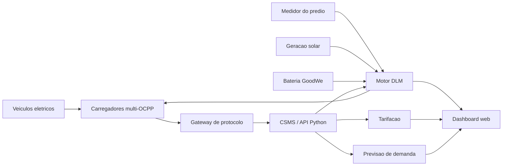

# ChargeGrid Intelligence

Prova de conceito da Sprint 2 do desafio GoodWe, desenvolvida pela Equipe 04
do curso de Ciencias da Computacao da FIAP.

O projeto evolui a proposta conceitual da Sprint 1 para um sistema funcional que
simula a operacao de uma infraestrutura comercial de recarga de veiculos
eletricos.

## Funcionalidades

- **Gerenciamento dinamico de carga (DLM):** distribui a potencia disponivel sem
  ultrapassar a demanda contratada.
- **Priorizacao adaptativa:** considera categoria do usuario e nivel de bateria.
- **Gateway de interoperabilidade:** representa a normalizacao de OCPP 1.5,
  OCPP 1.6, OCPP 2.0.1 e protocolo proprietario.
- **Tarifacao:** calcula energia entregue e receita estimada conforme o horario.
- **Previsao de demanda:** usa regressao linear treinada com 56 dias de dados
  sinteticos para gerar uma curva horaria.
- **Dashboard web:** apresenta indicadores, alertas, despacho por carregador e
  previsao das proximas 24 horas.

## Como executar

Requisito: Python 3.10 ou superior.

```bash
python run.py
```

Depois, acesse:

```text
http://127.0.0.1:8000
```

Nao e necessario instalar bibliotecas externas.

## Como demonstrar

1. Execute o projeto e abra o dashboard.
2. Observe o cenario inicial, configurado para gerar uma sobrecarga.
3. Clique em **Executar simulacao**.
4. Compare a potencia solicitada com a potencia alocada.
5. Observe que cargas urgentes recebem mais potencia.
6. Altere consumo do predio, geracao solar, BESS ou horario.
7. Execute novamente e compare alertas, tarifa e receita.

## Logica do DLM

O limite disponivel para recarga e calculado por:

```text
potencia disponivel =
  demanda contratada
  - consumo do predio
  + geracao solar
  + suporte da bateria BESS
```

Quando a soma solicitada pelos carregadores supera esse limite, o algoritmo
divide a potencia proporcionalmente. O peso de cada carregador combina:

```text
peso = prioridade do usuario x urgencia da bateria
```

O algoritmo redistribui sobras ate atender integralmente uma carga ou consumir
toda a potencia disponivel.

## Inteligencia artificial

A PoC inclui um modelo de regressao linear implementado em Python e treinado por
gradiente descendente. As variaveis consideradas sao:

- hora do dia;
- dia util ou fim de semana;
- temperatura;
- ocorrencia de evento local.

Os dados de treinamento sao sinteticos e reproduziveis. Portanto, o modelo
demonstra o pipeline de IA, mas nao deve ser interpretado como previsao
operacional validada. Uma etapa futura deve substituir esses dados por medicoes
reais do estacionamento.

## Arquitetura



Mais detalhes estao em [docs/ARQUITETURA.md](docs/ARQUITETURA.md).

Os casos reproduziveis para avaliacao estao em
[docs/CENARIOS_DE_TESTE.md](docs/CENARIOS_DE_TESTE.md).

## Estrutura

```text
chargegrid/
  models.py       entidades de carregadores e alocacoes
  predictor.py    modelo preditivo
  simulator.py    DLM, gateway OCPP e tarifacao
  server.py       servidor HTTP e API
web/
  index.html      dashboard
  styles.css      interface responsiva
  app.js          integracao com a API
tests/
  test_simulator.py
docs/
  ARQUITETURA.md
```

## Testes

```bash
python -m unittest discover -s tests -v
```

## Limitacoes

- Nao ha comunicacao com carregadores fisicos.
- O pagamento e apenas calculado, sem transacao PIX ou cartao.
- O gateway representa a normalizacao, sem implementar o transporte WebSocket
  completo do OCPP.
- O modelo preditivo usa dados sinteticos.

Essas limitacoes mantem a prova de conceito executavel e focada na demonstracao
da logica central proposta na Sprint 1.

## Gestao do projeto

O quadro com backlog, tarefas concluidas e proximos passos esta em
[KANBAN.md](KANBAN.md).

## Equipe

- Angela Sousa Takezawa - RM 570797
- Mateus de Oliveira Fernandes Neves - RM 572431
- Paulo Henrique Lira Bilac de Araujo - RM 569496
- Pedro Soares de Souza - RM 571285
- Olavo Dadario Vianna Barreto - RM 569272
